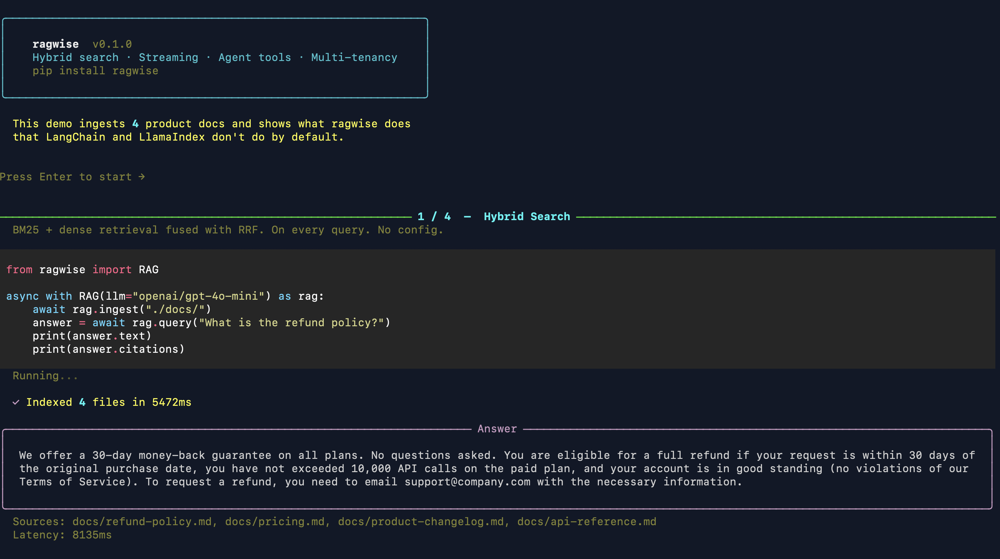
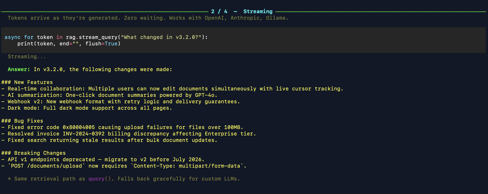
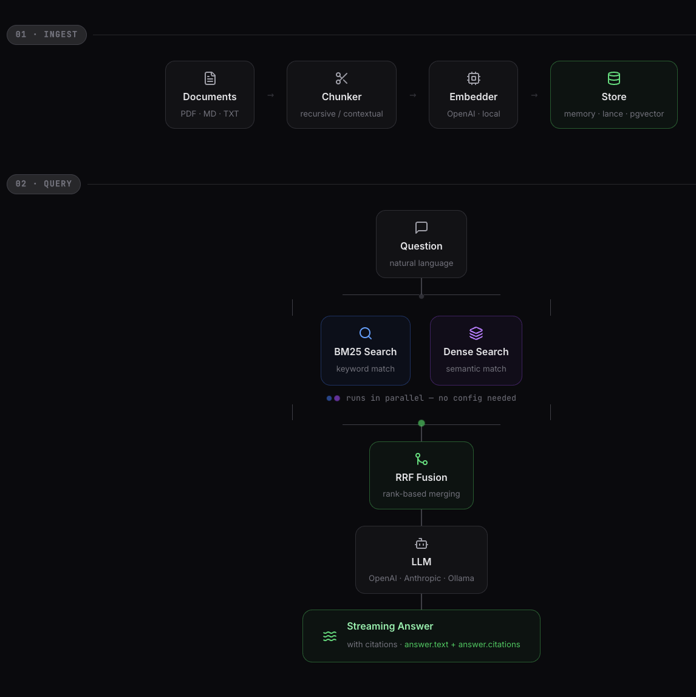
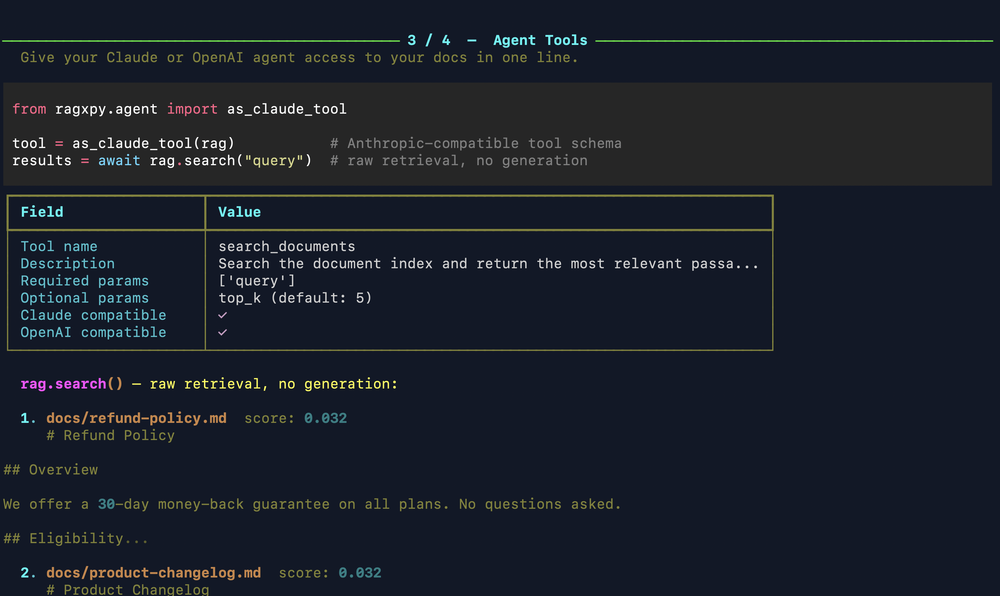
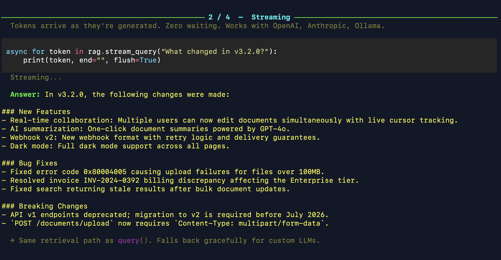
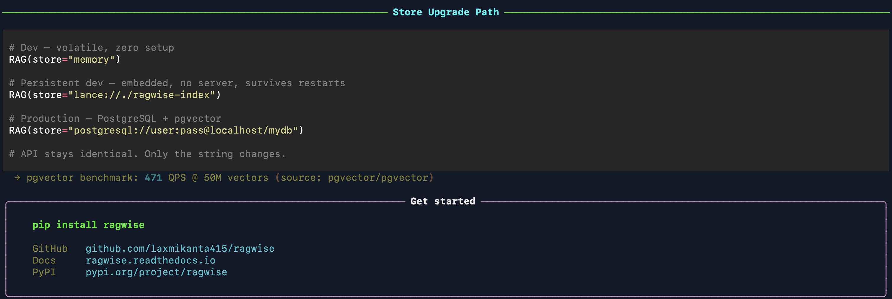

# ragwise

[](https://github.com/laxmikanta415/ragwise/actions/workflows/ci.yml)
[](https://pypi.org/project/ragwise/)
[](https://pypi.org/project/ragwise/)
[](https://pypi.org/project/ragwise/)
[](LICENSE)
[](https://ragwise.readthedocs.io)
[](https://github.com/astral-sh/ruff)

**The retrieval layer your agents need — hybrid BM25+dense search, retrieval observability, agent tools, and temporal filtering on by default. pip install. No Docker.**

[Docs](https://ragwise.readthedocs.io) · [Changelog](CHANGELOG.md) · [PyPI](https://pypi.org/project/ragwise/) · [Discussions](https://github.com/laxmikanta415/ragwise/discussions)



<video src="https://github.com/user-attachments/assets/96cd2ae9-e591-4c24-b3bf-8beb505446cc" controls width="100%"></video>

---

## Install

```bash
pip install ragwise
```

## Quickstart

```python
from ragwise import RAG, QueryConfig

async with RAG(llm="openai/gpt-4o-mini", reranker="flashrank") as rag:
    result = await rag.ingest("./docs/")
    print(result)  # IngestResult(chunks_created=42, skipped=0, failed_files=[])

    answer = await rag.query("What is the refund policy?")
    print(answer.text)
    print(answer.citations[0].text)    # passage text
    print(answer.citations[0].source)  # "docs/refund-policy.md"
    print(answer.trace.retrieval_ms)   # 34
    print(answer.trace.cost_usd)       # 0.00021
```



---

## How it Works

A two-phase pipeline — ingest once, query with hybrid search every time. BM25 and dense retrieval run in parallel and are fused with RRF, scoring **18% higher NDCG** than dense-only.



| | Dense-only | BM25-only | Hybrid (ragwise) |
|---|---|---|---|
| NDCG score | 0.72 | 0.65 | **0.85** |

---

## Why ragwise?

| Feature | ragwise | LangChain | LlamaIndex | RAGFlow |
|---|---|---|---|---|
| Lines to get started | **4** | 40+ | 20+ | Docker setup |
| Hybrid search by default | ✅ | ❌ | opt-in | ✅ (Docker) |
| pip install, no server | ✅ | ✅ | ✅ | ❌ |
| Async-first | ✅ | partial | partial | ❌ |
| Streaming | ✅ | partial | partial | ❌ |
| Retrieval trace (always-on) | ✅ | ❌ | ❌ | ❌ |
| Passage-level citations | ✅ | ❌ | partial | ❌ |
| Temporal filtering (`as_of`) | ✅ | ❌ | ❌ | ❌ |
| Agent tool built-in | ✅ | ❌ | ❌ | ❌ |
| Multi-tenant isolation | ✅ | ❌ | ❌ | ❌ |
| Built-in eval | ✅ | ❌ | partial | ❌ |

---

## Observability

Every query populates `answer.trace` — no setup, no extra code. Debug bad retrieval in seconds.

```python
answer = await rag.query("What is the refund policy?")

# Timing and cost
print(answer.trace.retrieval_ms)   # 34
print(answer.trace.generation_ms)  # 812
print(answer.trace.cost_usd)       # 0.00021

# Per-chunk scores
for chunk in answer.trace.retrieved_chunks:
    print(chunk.source, chunk.bm25_score, chunk.dense_score, chunk.rrf_score)

# Cache hit?
print(answer.trace.cache_hit)       # True / False
print(answer.trace.query_variants)  # ["What is...", "Explain the refund..."]
```

---

## Passage-Level Citations

Citations include the actual passage text, page number, and confidence score — not just filenames.

```python
for c in answer.citations:
    print(c.source)    # "docs/refund-policy.md"
    print(c.text)      # "Refunds are processed within 5 business days..."
    print(c.score)     # 0.91
    print(c.page)      # 3
    c.explain()        # prints human-readable ranking explanation
```

---

## Confidence Gating

Stop hallucinations before they happen. When retrieval is too weak, ragwise returns a structured "no answer" instead of calling the LLM.

```python
async with RAG(llm="openai/gpt-4o-mini", confidence_threshold=0.7) as rag:
    answer = await rag.query("...")
    if not answer.has_sufficient_context:
        print("Not enough evidence — answer withheld")
    else:
        print(answer.text)
```

---

## Document Management

Full index lifecycle — delete, list, and update documents across all backends. Required for GDPR right-to-erasure.

```python
# Remove a document and all its chunks
await rag.delete(source="docs/old-policy.md")

# List all indexed sources
sources = await rag.list_sources()
# [SourceInfo(source="docs/policy.md", chunk_count=12, last_updated=...)]

# Re-ingest a changed file (stale chunks auto-deleted before upsert)
await rag.update(source="docs/policy.md", path="./docs/policy.md")
```

---

## Temporal Filtering

Filter your index by document validity date — no competitor has this. Useful for policies, regulations, and versioned docs.

```python
# Ingest with validity window
await rag.ingest(
    "./docs/",
    metadata={"valid_from": "2024-01-01", "valid_until": "2024-12-31"},
)

# Query as of a specific date — expired chunks are automatically excluded
answer = await rag.query(
    "What is the refund policy?",
    config=QueryConfig(as_of="2024-06-15"),
)

# Find stale documents
stale = await rag.list_stale(older_than_days=90)
for doc in stale:
    print(doc.source, doc.last_updated)
```

---

## Semantic Cache

Reduce LLM API cost by 50–80%. Similar queries hit the cache even if the wording differs — smarter than SHA-256 exact match.

```python
async with RAG(
    llm="openai/gpt-4o-mini",
    cache=True,
    cache_threshold=0.92,   # cosine similarity threshold
) as rag:
    answer1 = await rag.query("What is the refund policy?")
    answer2 = await rag.query("How do refunds work?")  # cache hit
    print(answer2.trace.cache_hit)  # True — returned in <10ms
```

Set `RAGWISE_CACHE_REDIS_URL` for a Redis-backed cache shared across processes.

---

## Query Expansion (RAG-Fusion)

Generate N query variants automatically, retrieve for each, and fuse with RRF. Higher recall, especially for ambiguous questions.

```python
answer = await rag.query(
    "How are refunds processed?",
    config=QueryConfig(n_queries=3),
)
print(answer.trace.query_variants)
# ["How are refunds processed?", "What is the refund timeline?", "Explain the returns policy"]
```

---

## Agent Tools

Wire your entire document index into any Claude or OpenAI agent — stateful across calls, with loop detection and context budget tracking.

```python
from ragwise.agent import as_claude_tool_suite, AgentSession

# Single-turn tool
tool = as_claude_tool(rag)

# Multi-turn stateful session (deduplicates chunks, detects loops)
session = AgentSession(rag)
tools = as_claude_tool_suite(rag, max_iterations=5)
# Returns: search_documents, get_document_context, check_context_budget

response = anthropic.messages.create(
    model="claude-opus-4-6",
    tools=tools,
    messages=[{"role": "user", "content": question}],
)
```



---

## Streaming

Tokens stream as they're generated. Works with OpenAI, Anthropic, and Ollama — same two lines regardless of provider.

```python
async for token in rag.stream_query("What changed in v3.2?"):
    print(token, end="", flush=True)
```



---

## FastAPI Integration

Production-ready HTTP pattern — lifespan management and dependency injection built in.

```python
from ragwise.fastapi import RAGLifespan, get_rag, stream_response
from fastapi import FastAPI, Depends

app = FastAPI(lifespan=RAGLifespan(llm="openai/gpt-4o-mini"))

@app.get("/query")
async def query(q: str, rag=Depends(get_rag)):
    answer = await rag.query(q)
    return {"text": answer.text, "citations": [c.source for c in answer.citations]}

@app.get("/stream")
async def stream(q: str, rag=Depends(get_rag)):
    return stream_response(rag.stream_query(q))
```

---

## Testing

Deterministic, CI-free tests with VCR cassettes and a fake embedder. No API calls in CI.

```python
from ragwise.testing import cassette, FakeEmbedder, assert_retrieval

# Record once, replay in CI — zero API calls
with cassette("tests/cassettes/refund.yaml"):
    answer = await rag.query("What is the refund policy?")
    assert_retrieval(answer, must_include_source="docs/refund-policy.md")

# Fully deterministic embedder for unit tests
rag = RAG(embedder=FakeEmbedder(dim=384), llm="openai/gpt-4o-mini")
```

```bash
pip install ragwise[testing]   # auto-registers pytest plugin: fake_rag, recorded_rag fixtures
```

---

## Multi-Tenant Isolation

Tag documents at ingest, filter at query time. No store schema changes needed — works with all three backends.

```python
await rag.ingest("./org_a_docs/", tenant_id="org_a")
await rag.ingest("./org_b_docs/", tenant_id="org_b")

answer = await rag.query(
    "What is our data retention policy?",
    config=QueryConfig(tenant_id="org_a"),
)
```



---

## Store Options

Same API from local dev to production. Change one string — nothing else.

```python
RAG(store="memory")                      # dev — zero setup, volatile
RAG(store="lance://./ragwise-index")     # dev — persistent, no server
RAG(store="postgresql://user:pw@db/x")  # production — pgvector
```

```
memory  →  lance://  →  postgresql://
  ↑            ↑               ↑
 tests      staging        production
```

---

## Configuration

Full typed config with Pydantic — typos caught at construction, not at first query.

```python
from ragwise import RAG, RAGConfig, LLMConfig, QueryConfig

config = RAGConfig.from_env()   # reads RAGWISE_LLM_MODEL, RAGWISE_STORE_BACKEND

async with RAG(
    embedder="openai/text-embedding-3-small",
    store="lance://./my-index",
    llm="openai/gpt-4o-mini",
    reranker="flashrank",          # local, no GPU — or "cohere/rerank-4"
    chunk_size=512,
    chunk_overlap=64,
    cache=True,
    cache_threshold=0.92,
    confidence_threshold=0.7,
) as rag:
    result = await rag.ingest("./docs/", glob="**/*.md")
    answer = await rag.query(
        "What changed in v3.2?",
        config=QueryConfig(top_k=5, n_queries=3, as_of="2024-06-15"),
    )
```

---

## CLI

```bash
ragwise init           # generate ragwise_config.py with defaults
ragwise serve          # start HTTP API on localhost:8000
ragwise serve --port 9000
ragwise doctor         # health check: credentials, store, hybrid search, latency
```

`ragwise doctor` runs in under 10 seconds and prints a checkmark for each component — useful after first install or a dependency upgrade.

---

## Optional Extras

```bash
pip install ragwise[lance]       # LanceDB persistent store
pip install ragwise[postgres]    # PostgreSQL + pgvector
pip install ragwise[local-emb]   # sentence-transformers embedder + reranker
pip install ragwise[testing]     # VCR cassettes, FakeEmbedder, pytest plugin
pip install ragwise[eval]        # RAGAS + Langfuse eval loop
pip install ragwise[serve]       # ragwise serve HTTP API
```

---

## Who It's For

**✓ Python developers** who want production-ready RAG as a library, not a platform.  
**✓ AI engineers building agents** — wire your doc index into Claude or GPT in one line.  
**✓ Teams already on PostgreSQL** — zero new infrastructure with `store="postgresql://..."`.  
**✓ Anyone who values typed, async-first, minimal-dependency code.**

**✗ Not for you if** you need a no-code UI, knowledge graphs, or agent orchestration — use RAGFlow or LangGraph instead.

---

## Roadmap

v0.2.0 ships all of the above — typed config, document management, retrieval observability, passage citations, confidence gating, reranking, agent sessions, VCR-based testing, FastAPI integration, temporal filtering, semantic cache, query expansion, and document TTL.

What's next is driven by real usage — follow [GitHub Discussions](https://github.com/laxmikanta415/ragwise/discussions) to vote.

## Community

- **Questions & help** → [GitHub Discussions](https://github.com/laxmikanta415/ragwise/discussions)
- **Bug reports** → [GitHub Issues](https://github.com/laxmikanta415/ragwise/issues)
- **Contributing** → [CONTRIBUTING.md](CONTRIBUTING.md)

## License

MIT — see [LICENSE](LICENSE)
